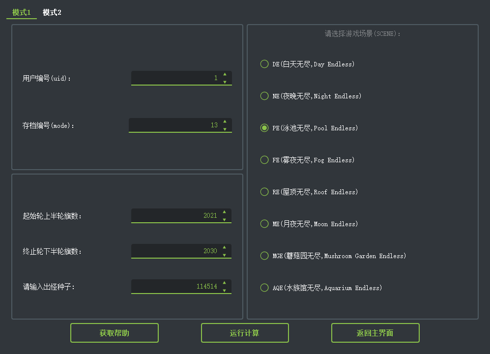
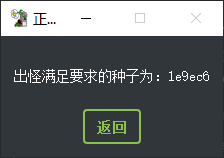
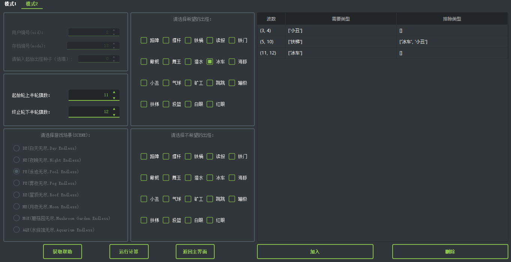

# **出怪计算器** #

----------

## 前言 ##

本计算器是在[@SKOSKX版](https://tieba.baidu.com/p/7713362872)基础上制作的魔改版。相较于原版，有以下特性:
1. **更更更更更高的效率**（高了多少请自行体会）
2. 将原模式1与模式3合并为新模式1，将原模式2与模式4合并为新模式2，原模式5有朝一日不咕的话……（
3. 加了gui（废话

## 模式1使用示例 ##
计算1号玩家，PE（存档编号为13）在种子114514下2021-2030旗的出怪：

结果如下：

## 模式2使用示例

计算节操掉尽的1号玩家PE从第3面旗到第16面旗均出扶梯且不出车丑红的种子：

作出如下设置后依次点击“加入”和“运行计算”，稍等片刻即可得出结果：

另一个例子：

计算节操掉尽的2号玩家PE 3-4F 出丑炸荷叶，5-10F出梯不出车丑，11-12F出车碾盆的种子：

输入以上信息后点击“加入”

如法炮制，最终输入完成的示意：

运行计算的结果：

## 关于参数的一些解释

### 用户编号

第几个创建的用户就是几，以本人的游戏举例：

### 存档编号

正常情况下，DE,NE,PE,FE,RE分别为11，12，13，14，15

如果使用修改器改变了场景，存档编号以修改前的场景（也是右下角显示的场景）为准

但游戏场景以修改后的场景为准

## 种子如何查看、修改？

第一步，下载 [pvz tools](https://pvz.lmintlcx.com/tools/)

第二步，打开游戏和pvz tools

第三步，打开游戏中的无尽模式，在pvz tools中点击出怪—切换详细模式

这里可以看到并修改当前的种子

------

# 开发者文档

### 总述

​	该程序基于*python3.8&pyqt5*开发，使用qt_material作为皮肤。其中cpu密集计算部分(模式2)使用*c++&pybind11*多线程编写充分利用cpu多核资源。该程序较初版程序速度快500~1000倍左右，使得在int32范围内短时间穷举全部种子成为现实。

### seedFinder模块

**该模块必须在python3.8下使用。**在其他版本下使用请自行编译。如果觉得该程序不错，不如star一个吧！

- #### 方法

1. **`appear(uid:int, mode:int, scene:str, level:int, seed:int)`**用于获取在当前波数下的出怪类型，返回值为list。

- #### 类

1. **`requestToSeed(uid:int, mode:int, scene:str, level_beginning:int, level_ending:int, seed:int)`**用于获取指定条件下的种子，返回值为int。

   ##### 类属性

   - **`seed:int`**用于获取当前计算到的种子。
   - **`overflow:bool`**用于获取是否有计算结果。
   - **`stopThread:bool`**用于中断计算线程。

   ##### 类方法

   - **`calc(idNeeded:list[list], idRefused:list[list])`**两个参数均为二维列表，每个元素为每波要求的出怪类型列表(空列表为无要求)。计算时会堵塞线程，为获取实时进度请使用多线程。